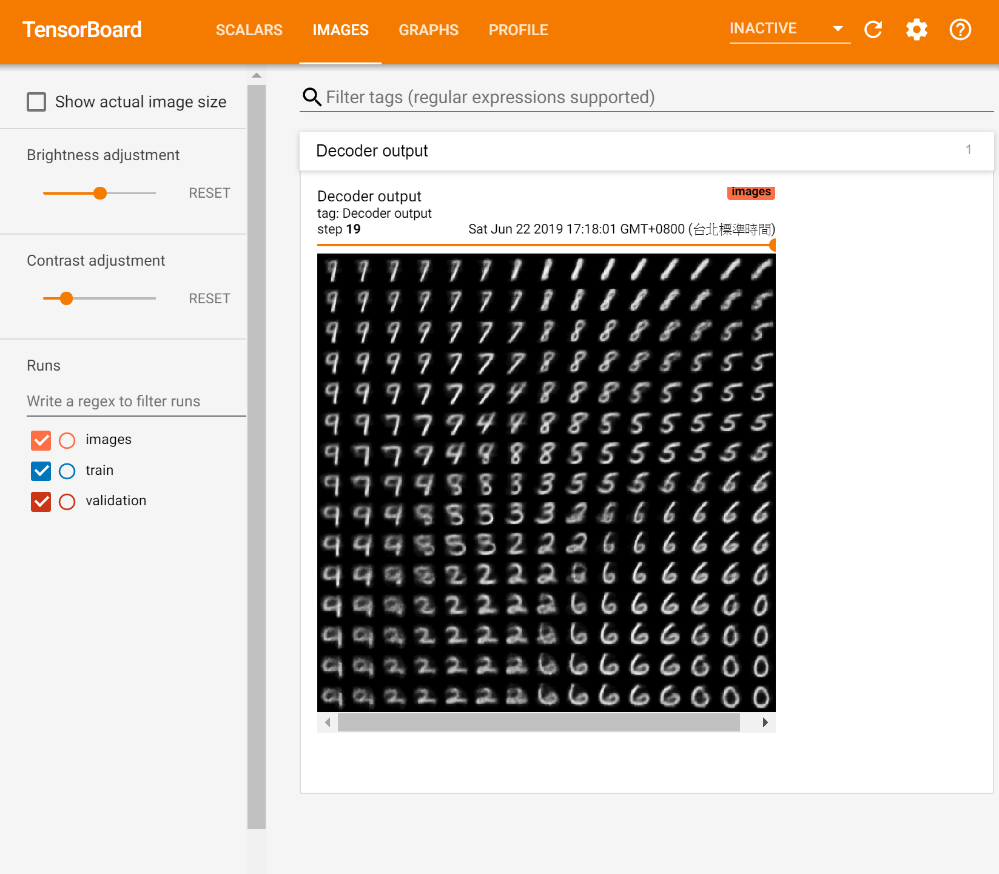

# TF2-VAE
## Usage

- Requirements
    - Numpy == 1.19.5
    - TensorFlow == 2.5.0
    - TensorFlow Datasets == 4.3.0

- Training VAE
    ```bash
    python train.py
    ```

- Test VAE
    ```bash
    python test.py
    ```
    
- TensorBoard
    ```bash
    tensorboard --logdir logs_vae
    ```

## Results
Results Images


TensorBoard Output


## References
[Auto-Encoding Variational Bayes](https://arxiv.org/abs/1312.6114)